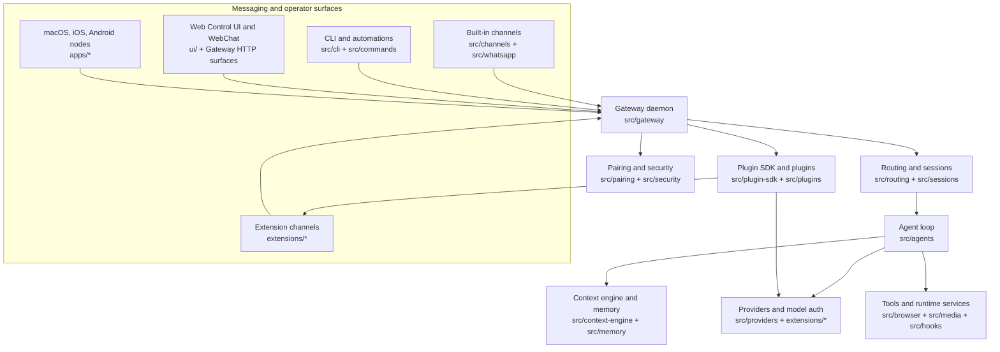
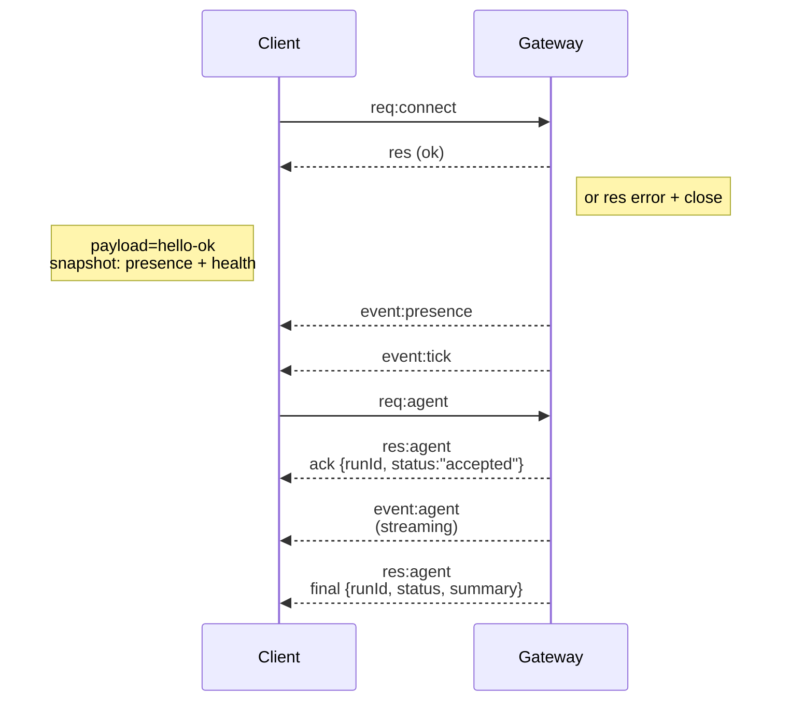

# Gateway architecture

Last updated: 2026-03-19

## Overview

- A single long‑lived **Gateway** owns all messaging surfaces (WhatsApp via
  Baileys, Telegram via grammY, Slack, Discord, Signal, iMessage, WebChat).
- Control-plane clients (macOS app, CLI, web UI, automations) connect to the
  Gateway over **WebSocket** on the configured bind host (default
  `127.0.0.1:18789`).
- **Nodes** (macOS/iOS/Android/headless) also connect over **WebSocket**, but
  declare `role: node` with explicit caps/commands.
- One Gateway per host; it is the only place that opens a WhatsApp session.
- The **canvas host** is served by the Gateway HTTP server under:
  - `/__openclaw__/canvas/` (agent-editable HTML/CSS/JS)
  - `/__openclaw__/a2ui/` (A2UI host)
    It uses the same port as the Gateway (default `18789`).

## Repository structure

The repo is a pnpm workspace with a small set of top-level areas that map
closely to the runtime:

| Path                         | Role                                                                                   |
| ---------------------------- | -------------------------------------------------------------------------------------- |
| `src/`                       | Core OpenClaw runtime: Gateway, agents, channels, routing, sessions, config, and CLI   |
| `apps/`                      | Native app surfaces for Android, iOS, macOS, and shared code in `apps/shared/`         |
| `ui/`                        | Browser-facing UI code that backs the control surfaces served by the Gateway           |
| `extensions/`                | Optional workspace packages for model providers, channels, tools, and integrations     |
| `packages/`                  | Supporting workspace packages that are published or shared across the monorepo         |
| `skills/`                    | Built-in skill bundles and skill metadata used by agent workflows                      |
| `docs/`                      | Mintlify documentation for concepts, setup, channels, nodes, providers, and operations |
| `test/` and `test-fixtures/` | Cross-cutting integration tests and reusable fixtures                                  |
| `scripts/`                   | Build, packaging, codegen, release, and maintenance scripts                            |
| `Swabble/`                   | Related Swift package shipped alongside the main workspace                             |

## Core source modules

`src/` is organized by runtime responsibility rather than by framework:

| Module                                                                                                                          | Responsibility                                                                           |
| ------------------------------------------------------------------------------------------------------------------------------- | ---------------------------------------------------------------------------------------- |
| `src/gateway`                                                                                                                   | Long-lived Gateway daemon, WS/HTTP servers, protocol handlers, and event fanout          |
| `src/agents`                                                                                                                    | Agent loop, tool execution, prompt assembly, model failover, and embedded Pi integration |
| `src/channels`                                                                                                                  | Shared channel abstractions and transport-agnostic driver logic                          |
| `src/telegram`, `src/discord`, `src/slack`, `src/signal`, `src/imessage`, `src/web`, and `src/whatsapp` plus channel extensions | Built-in and plugin channel implementations                                              |
| `src/routing` and `src/sessions`                                                                                                | Session keys, sender-to-session mapping, and message routing                             |
| `src/context-engine` and `src/memory`                                                                                           | Context assembly, compaction inputs, and memory persistence                              |
| `src/providers` plus provider extensions                                                                                        | Model-provider integration points and runtime provider discovery                         |
| `src/plugin-sdk` and `src/plugins`                                                                                              | Public extension seams and plugin loading/runtime glue                                   |
| `src/cli` and `src/commands`                                                                                                    | Command-line entry points, operator commands, and onboarding helpers                     |
| `src/config`, `src/security`, and `src/pairing`                                                                                 | Config loading, auth controls, pairing, and trust decisions                              |
| `src/media`, `src/browser`, `src/canvas-host`, and `src/node-host`                                                              | Media pipeline, browser automation, Canvas/A2UI, and node-side capabilities              |
| `src/terminal`, `src/tui`, and `src/wizard`                                                                                     | Terminal rendering, interactive flows, and onboarding UX                                 |

## Components and flows

### Gateway (daemon)

- Maintains provider connections.
- Exposes a typed WS API (requests, responses, server‑push events).
- Validates inbound frames against JSON Schema.
- Emits events like `agent`, `chat`, `presence`, `health`, `heartbeat`, `cron`.

### Clients (mac app / CLI / web admin)

- One WS connection per client.
- Send requests (`health`, `status`, `send`, `agent`, `system-presence`).
- Subscribe to events (`tick`, `agent`, `presence`, `shutdown`).

### Nodes (macOS / iOS / Android / headless)

- Connect to the **same WS server** with `role: node`.
- Provide a device identity in `connect`; pairing is **device‑based** (role `node`) and
  approval lives in the device pairing store.
- Expose commands like `canvas.*`, `camera.*`, `screen.record`, `location.get`.

Protocol details:

- [Gateway protocol](/gateway/protocol)

### WebChat

- Static UI that uses the Gateway WS API for chat history and sends.
- In remote setups, connects through the same SSH/Tailscale tunnel as other
  clients.

## Runtime block diagram



## How the pieces fit together

1. A message enters through a built-in channel or an extension channel.
2. The Gateway authenticates the caller, normalizes the event, and resolves the
   target session.
3. Routing and session code decide which agent lane or workspace should handle
   the request.
4. The agent loop assembles prompts, context, memory, tools, and provider
   settings before calling the model runtime.
5. Tool results, model output, and follow-up events stream back through the
   Gateway to chat surfaces, operator clients, or paired nodes.
6. Plugins and extensions can add new channels, providers, and tool surfaces
   without changing the Gateway protocol itself.

## Connection lifecycle (single client)



## Wire protocol (summary)

- Transport: WebSocket, text frames with JSON payloads.
- First frame **must** be `connect`.
- After handshake:
  - Requests: `{type:"req", id, method, params}` → `{type:"res", id, ok, payload|error}`
  - Events: `{type:"event", event, payload, seq?, stateVersion?}`
- If `OPENCLAW_GATEWAY_TOKEN` (or `--token`) is set, `connect.params.auth.token`
  must match or the socket closes.
- Idempotency keys are required for side‑effecting methods (`send`, `agent`) to
  safely retry; the server keeps a short‑lived dedupe cache.
- Nodes must include `role: "node"` plus caps/commands/permissions in `connect`.

## Pairing + local trust

- All WS clients (operators + nodes) include a **device identity** on `connect`.
- New device IDs require pairing approval; the Gateway issues a **device token**
  for subsequent connects.
- **Local** connects (loopback or the gateway host’s own tailnet address) can be
  auto‑approved to keep same‑host UX smooth.
- All connects must sign the `connect.challenge` nonce.
- Signature payload `v3` also binds `platform` + `deviceFamily`; the gateway
  pins paired metadata on reconnect and requires repair pairing for metadata
  changes.
- **Non‑local** connects still require explicit approval.
- Gateway auth (`gateway.auth.*`) still applies to **all** connections, local or
  remote.

Details: [Gateway protocol](/gateway/protocol), [Pairing](/channels/pairing),
[Security](/gateway/security).

## Protocol typing and codegen

- TypeBox schemas define the protocol.
- JSON Schema is generated from those schemas.
- Swift models are generated from the JSON Schema.

## Remote access

- Preferred: Tailscale or VPN.
- Alternative: SSH tunnel

  ```bash
  ssh -N -L 18789:127.0.0.1:18789 user@host
  ```

- The same handshake + auth token apply over the tunnel.
- TLS + optional pinning can be enabled for WS in remote setups.

## Operations snapshot

- Start: `openclaw gateway` (foreground, logs to stdout).
- Health: `health` over WS (also included in `hello-ok`).
- Supervision: launchd/systemd for auto‑restart.

## Invariants

- Exactly one Gateway controls a single Baileys session per host.
- Handshake is mandatory; any non‑JSON or non‑connect first frame is a hard close.
- Events are not replayed; clients must refresh on gaps.
